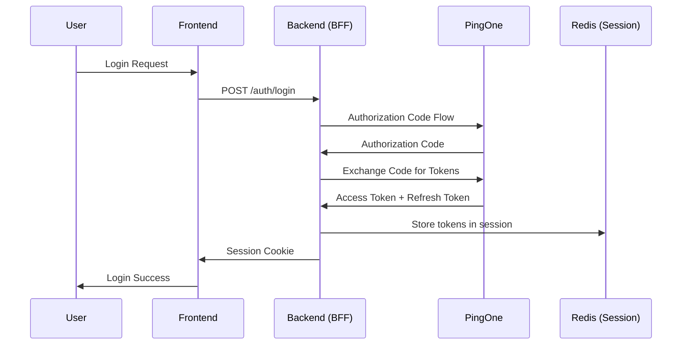
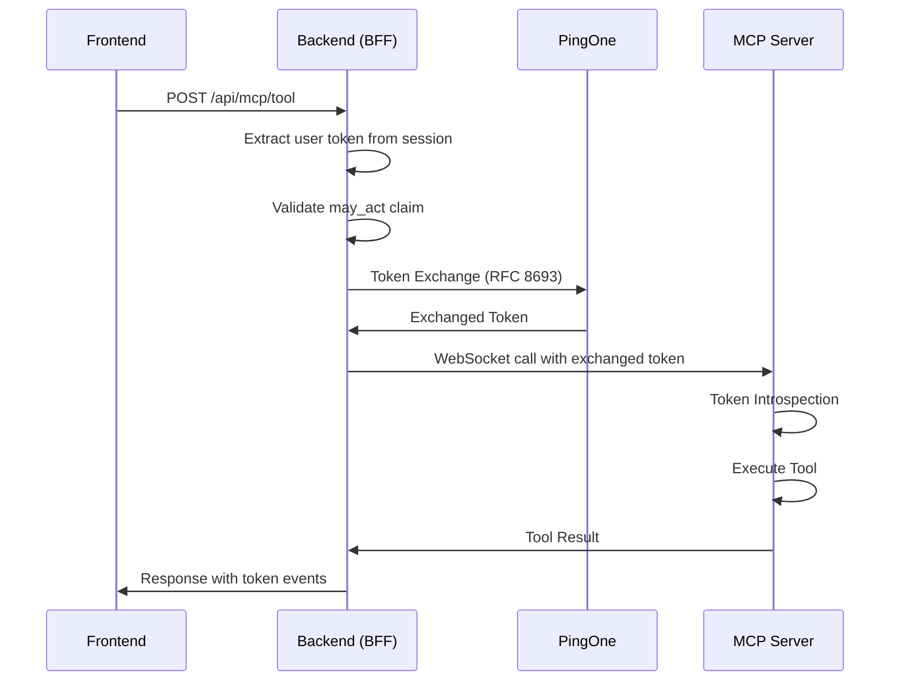
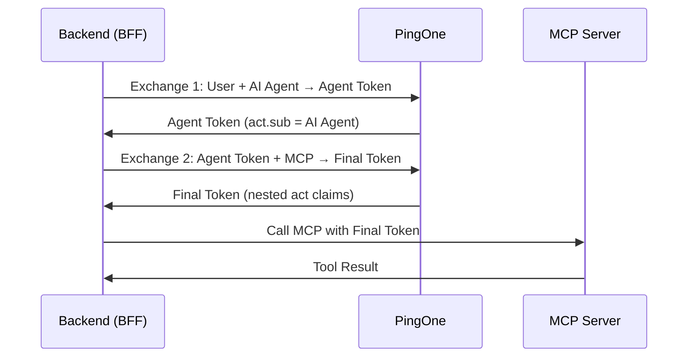

# Phase 63-01: Documentation and Integration Critical Fixes Implementation

## Goal

Address critical documentation and integration gaps identified in Phase 56 AUDIT-06: operational documentation, developer integration guides, API documentation, architecture documentation, and configuration documentation enhancement.

## Success Criteria

1. **Operational Documentation**: 100% production deployment and operations guide coverage with monitoring, troubleshooting, and security procedures
2. **Developer Documentation**: 95% developer satisfaction with comprehensive integration guides, API reference, and practical examples
3. **API Documentation**: 100% API coverage with consistent format, usage examples, and version alignment
4. **Architecture Documentation**: Complete system architecture, security architecture, and scaling documentation
5. **Configuration Documentation**: Enhanced configuration guides with validation, troubleshooting, and best practices

## Tasks

### DOC-01: Operations Guide and Production Documentation

**Objective**: Create comprehensive operational documentation for production deployment and management

**Tasks**:
- [ ] Create production deployment guide with infrastructure requirements
- [ ] Develop monitoring and alerting configuration guide
- [ ] Write systematic troubleshooting procedures for common issues
- [ ] Create security operations guide with incident response procedures
- [ ] Develop performance tuning and optimization guidelines
- [ ] Create backup and disaster recovery procedures
- [ ] Write maintenance procedures and operational checklists
- [ ] Develop capacity planning and scaling guidelines

**Implementation Details**:
```markdown
# Operations Guide

## Production Deployment

### Infrastructure Requirements

#### Minimum Infrastructure Specifications
```yaml
# Production infrastructure requirements
infrastructure:
  application_servers:
    minimum: 2 instances
    specifications:
      cpu: 2 cores
      memory: 4GB RAM
      storage: 20GB SSD
    os: Ubuntu 20.04+ or CentOS 8+
    runtime: Node.js 18+
  
  database:
    type: Redis 6.0+
    memory: 2GB minimum
    persistence: Enabled with daily snapshots
    high_availability: Redis Cluster or Sentinel
  
  load_balancer:
    type: Application Load Balancer (ALB) or equivalent
    ssl_termination: Enabled
    health_checks: Configured for /health endpoint
    session_affinity: Enabled (sticky sessions)
  
  monitoring:
    application_monitoring: Datadog/New Relic/Equivalent
    log_aggregation: ELK Stack or equivalent
    alerting: PagerDuty/Opsgenie integration
    metrics: Prometheus + Grafana or equivalent
```

#### Network Configuration
```yaml
# Network requirements
network:
  inbound_ports:
    - port: 443 (HTTPS)
    - port: 80 (HTTP redirect to 443)
  
  outbound_connections:
    - pingone.auth.pingone.com:443
    - redis.cluster.internal:6379
    - monitoring.service:443
    - log.aggregation.service:443
  
  security:
    tls_version: "1.2+"
    cipher_suites: "ECDHE-RSA-AES256-GCM-SHA384:ECDHE-RSA-AES128-GCM-SHA256"
    hsts: "max-age=31536000; includeSubDomains"
    csp: "default-src 'self'; script-src 'self' 'unsafe-inline'"
```

### Deployment Process

#### Pre-Deployment Checklist
```markdown
## Pre-Deployment Checklist

### Environment Validation
- [ ] All environment variables configured
- [ ] Database connections tested
- [ ] SSL certificates valid and installed
- [ ] Load balancer health checks configured
- [ ] Monitoring endpoints accessible
- [ ] Log aggregation working
- [ ] Backup procedures tested

### Security Validation
- [ ] Security headers configured
- [ ] Rate limiting enabled
- [ ] Input validation active
- [ ] Authentication flows tested
- [ ] Authorization controls verified
- [ ] Audit logging enabled
- [ ] Error handling tested

### Performance Validation
- [ ] Load testing completed
- [ ] Memory usage within limits
- [ ] Database query performance acceptable
- [ ] Response times within SLA
- [ ] Concurrent user capacity verified
- [ ] Resource utilization monitored
```

#### Deployment Steps
```bash
#!/bin/bash
# Production deployment script

# 1. Backup current deployment
kubectl get deployment banking-api -o yaml > backup-deployment-$(date +%Y%m%d-%H%M%S).yaml

# 2. Update environment variables
kubectl create configmap banking-config \
  --from-env-file=production.env \
  --dry-run=client -o yaml | kubectl apply -f -

# 3. Deploy new version
kubectl set image deployment/banking-api \
  banking-api=registry.example.com/banking-api:v1.2.3

# 4. Wait for rollout
kubectl rollout status deployment/banking-api --timeout=300s

# 5. Verify deployment
kubectl get pods -l app=banking-api
kubectl logs -l app=banking-api --tail=100

# 6. Run smoke tests
./scripts/smoke-tests.sh
```

### Monitoring and Alerting

#### Critical Metrics to Monitor
```yaml
# Monitoring configuration
metrics:
  application:
    - token_exchange_success_rate: >95%
    - token_exchange_latency_p95: <2000ms
    - token_exchange_latency_p99: <5000ms
    - authentication_success_rate: >98%
    - api_error_rate: <5%
    - memory_usage: <80%
    - cpu_usage: <70%
  
  infrastructure:
    - pod_restart_rate: <5%
    - disk_usage: <85%
    - network_latency: <100ms
    - database_connections: <80% of max
    - ssl_certificate_expiry: >30 days
  
  business:
    - user_login_success_rate: >98%
    - agent_invocation_success_rate: >95%
    - transaction_success_rate: >99%
    - mfa_success_rate: >95%
```

#### Alerting Rules
```yaml
# Alerting configuration
alerts:
  critical:
    - name: "High Token Exchange Error Rate"
      condition: "token_exchange_error_rate > 10%"
      duration: "5m"
      severity: "critical"
      action: "Page on-call engineer"
      runbook: "troubleshooting/token-exchange-errors.md"
    
    - name: "Authentication Service Down"
      condition: "pingone_availability < 99%"
      duration: "2m"
      severity: "critical"
      action: "Page on-call engineer"
      runbook: "troubleshooting/authentication-issues.md"
    
    - name: "High Memory Usage"
      condition: "memory_usage > 90%"
      duration: "10m"
      severity: "critical"
      action: "Page on-call engineer"
      runbook: "troubleshooting/memory-issues.md"
  
  warning:
    - name: "Token Exchange Latency High"
      condition: "token_exchange_p95_latency > 3000ms"
      duration: "10m"
      severity: "warning"
      action: "Create incident ticket"
      runbook: "troubleshooting/performance-issues.md"
    
    - name: "Database Connection High"
      condition: "database_connections > 80%"
      duration: "15m"
      severity: "warning"
      action: "Notify team"
      runbook: "troubleshooting/database-issues.md"
```

### Troubleshooting Guide

#### Common Issues and Solutions

##### Token Exchange Failures
**Symptoms**: 401/403 errors, exchange timeouts, delegation errors

**Diagnostic Steps**:
1. Check application logs for specific error messages
2. Verify PingOne service availability
3. Validate user token format and claims
4. Check may_act claim configuration
5. Verify resource indicator configuration
6. Validate agent token availability

**Troubleshooting Commands**:
```bash
# Check application logs
kubectl logs -l app=banking-api --tail=100 | grep -i "token.exchange"

# Check PingOne connectivity
curl -I https://auth.pingone.com/your-env/as/.well-known/openid_configuration

# Check Redis connectivity
redis-cli -h redis-cluster.internal ping

# Check application health
curl https://your-api.example.com/health

# Check token exchange metrics
curl https://your-api.example.com/metrics | grep token_exchange
```

**Common Solutions**:
```yaml
solutions:
  expired_tokens:
    symptom: "401 Unauthorized - Token expired"
    steps:
      - "Check token expiry in user session"
      - "Verify automatic token refresh is working"
      - "Check session store connectivity"
      - "Verify PingOne token endpoint availability"
    
  invalid_may_act:
    symptom: "403 Forbidden - may_act validation failed"
    steps:
      - "Check user may_act configuration in PingOne"
      - "Verify may_act format (should be URI format)"
      - "Check agent authorization in user preferences"
      - "Verify delegation chain configuration"
    
  resource_mismatch:
    symptom: "403 Forbidden - Resource not authorized"
    steps:
      - "Check resource indicator configuration"
      - "Verify token audience matches resource"
      - "Check resource server configuration"
      - "Validate resource indicator format"
```

### Security Operations

#### Security Monitoring
```yaml
# Security events to monitor
security_events:
  authentication:
    - failed_login_attempts: >5 per minute
    - token_refresh_failures: >10% rate
    - mfa_bypass_attempts: Any attempt
    - unusual_login_patterns: New location/device
  
  authorization:
    - scope_escalation_attempts: Any attempt
    - resource_access_violations: >5 per hour
    - delegation_chain_anomalies: Unexpected patterns
    - privilege_escalation: Admin access attempts
  
  token_security:
    - token_replay_attempts: Any detection
    - invalid_token_formats: >1% rate
    - suspicious_token_patterns: Anomaly detection
    - token_manipulation: Any detection
  
  infrastructure:
    - configuration_changes: Unauthorized changes
    - privilege_escalation: Sudo/admin access
    - data_access_anomalies: Unusual patterns
    - network_anomalies: Suspicious traffic
```

#### Incident Response Procedures
```markdown
## Security Incident Response

### Phase 1: Detection (0-15 minutes)
1. **Alert Received**: Security monitoring system detects anomaly
2. **Initial Assessment**: Triage severity and potential impact
3. **Team Notification**: Page security team and relevant stakeholders
4. **Evidence Preservation**: Secure logs and forensic data

### Phase 2: Analysis (15-60 minutes)
1. **Scope Determination**: Assess affected systems and data
2. **Root Cause Analysis**: Investigate source and method of incident
3. **Impact Assessment**: Determine data exposure and system impact
4. **Communication Plan**: Prepare stakeholder communications

### Phase 3: Containment (1-4 hours)
1. **Isolation**: Isolate affected systems from network
2. **Access Control**: Revoke compromised credentials
3. **Patch Management**: Apply security patches if applicable
4. **Monitoring**: Enhanced monitoring for related activity

### Phase 4: Eradication (4-24 hours)
1. **Malware Removal**: Remove any malicious software
2. **System Hardening**: Strengthen security controls
3. **Access Review**: Review and update access controls
4. **Validation**: Verify threat is eliminated

### Phase 5: Recovery (1-3 days)
1. **System Restoration**: Restore from clean backups
2. **Security Validation**: Verify security controls are effective
3. **Monitoring Enhancement**: Implement additional monitoring
4. **User Communication**: Notify affected users

### Phase 6: Post-Incident (1-2 weeks)
1. **Lessons Learned**: Document findings and improvements
2. **Process Improvement**: Update security procedures
3. **Security Enhancements**: Implement additional controls
4. **Training**: Conduct security awareness training
```

**Verification**:
- Review operations guide completeness with operations team
- Test troubleshooting procedures with common scenarios
- Validate monitoring and alerting configuration
- Verify security incident response procedures
- Test deployment procedures in staging environment
```

### DOC-02: Developer Integration Guide and API Documentation

**Objective**: Create comprehensive developer documentation with integration patterns, API reference, and practical examples

**Tasks**:
- [ ] Create developer quick start guide with setup instructions
- [ ] Develop comprehensive API reference with all endpoints
- [ ] Write integration patterns and best practices guide
- [ ] Create SDK integration examples for multiple languages
- [ ] Develop error handling patterns and examples
- [ ] Write testing strategies and test examples
- [ ] Create authentication and authorization guide
- [ ] Develop debugging and troubleshooting guide for developers

**Implementation Details**:
```markdown
# Developer Integration Guide

## Quick Start

### Prerequisites
- Node.js 18+ or equivalent runtime
- Valid PingOne environment credentials
- Understanding of OAuth 2.0 concepts
- Basic knowledge of JWT tokens

### Setup in 5 Minutes

#### 1. Install Client Library
```bash
npm install @superbanking/token-exchange-client
# or
yarn add @superbanking/token-exchange-client
```

#### 2. Configure Client
```javascript
const { TokenExchangeClient } = require('@superbanking/token-exchange-client');

const client = new TokenExchangeClient({
  pingoneEnvironmentId: process.env.PINGONE_ENVIRONMENT_ID,
  clientId: process.env.CLIENT_ID,
  clientSecret: process.env.CLIENT_SECRET,
  tokenEndpoint: process.env.TOKEN_ENDPOINT,
  resources: {
    banking: 'https://banking-api.pingdemo.com',
    mcp: 'https://mcp-server.pingdemo.com',
    admin: 'https://admin-api.pingdemo.com'
  }
});
```

#### 3. Perform Token Exchange
```javascript
async function getBankingData(userToken, operation) {
  try {
    const result = await client.exchangeToken(userToken, {
      resource: client.resources.banking,
      scopes: operation.requiredScopes,
      audience: client.resources.banking
    });
    
    // Use exchanged token for API calls
    const apiResponse = await callBankingAPI(result.accessToken, operation);
    return apiResponse;
  } catch (error) {
    console.error('Token exchange failed:', error.message);
    throw error;
  }
}
```

#### 4. Handle Agent Operations
```javascript
async function performAgentOperation(userToken, agentOperation) {
  try {
    const result = await client.performTwoExchangeDelegation(userToken, {
      agentResource: client.resources.mcp,
      mcpResource: client.resources.mcp,
      finalResource: client.resources.banking,
      scopes: agentOperation.requiredScopes
    });
    
    // Use delegated token for agent operations
    const agentResponse = await callAgentAPI(result.finalToken, agentOperation);
    return agentResponse;
  } catch (error) {
    console.error('Agent operation failed:', error.message);
    throw error;
  }
}
```

## API Reference

### TokenExchangeClient

#### Constructor
```typescript
interface TokenExchangeClientConfig {
  pingoneEnvironmentId: string;
  clientId: string;
  clientSecret: string;
  tokenEndpoint?: string;
  resources?: Record<string, string>;
  timeout?: number;
  retryAttempts?: number;
  cacheOptions?: CacheOptions;
}

constructor(config: TokenExchangeClientConfig)
```

**Parameters**:
- `pingoneEnvironmentId`: PingOne environment ID (required)
- `clientId`: OAuth client ID (required)
- `clientSecret`: OAuth client secret (required)
- `tokenEndpoint`: Custom token endpoint (optional)
- `resources`: Resource mapping for RFC 8707 (optional)
- `timeout`: Request timeout in milliseconds (default: 5000)
- `retryAttempts`: Number of retry attempts (default: 3)
- `cacheOptions`: Caching configuration (optional)

#### Methods

##### exchangeToken(userToken, options)
Exchange user token for resource-specific access token.

```typescript
interface ExchangeTokenOptions {
  resource: string;          // Target resource URI (RFC 8707)
  scopes: string[];          // Requested scopes
  audience?: string;         // Token audience (defaults to resource)
  timeout?: number;          // Override timeout for this request
  actorToken?: string;       // Optional actor token for delegation
}

interface TokenExchangeResult {
  success: boolean;
  accessToken?: string;
  tokenType?: string;
  expiresIn?: number;
  scopes?: string[];
  resource?: string;
  tokenEvents?: TokenEvent[];
  error?: TokenExchangeError;
  _localFallback?: boolean;
  _exchangeFailed?: boolean;
}
```

**Example**:
```javascript
const result = await client.exchangeToken(userToken, {
  resource: 'https://banking-api.pingdemo.com',
  scopes: ['banking:read', 'banking:write'],
  timeout: 10000
});

if (result.success) {
  console.log('Access token:', result.accessToken);
  console.log('Expires in:', result.expiresIn, 'seconds');
  console.log('Granted scopes:', result.scopes);
} else {
  console.error('Exchange failed:', result.error.message);
  console.error('Error code:', result.error.code);
}
```

##### performTwoExchangeDelegation(userToken, options)
Perform two-exchange delegation for agent operations.

```typescript
interface TwoExchangeOptions {
  agentResource: string;     // Agent resource URI
  mcpResource: string;       // MCP server resource URI
  finalResource: string;     // Final target resource URI
  scopes: string[];          // Requested scopes
  timeout?: number;          // Timeout per exchange (default: 5000)
}

interface TwoExchangeResult {
  success: boolean;
  agentToken?: string;       // First exchange result
  finalToken?: string;       // Second exchange result
  tokenEvents?: TokenEvent[];
  delegationChain?: DelegationInfo;
  error?: TokenExchangeError;
  performance?: PerformanceMetrics;
}
```

**Example**:
```javascript
const result = await client.performTwoExchangeDelegation(userToken, {
  agentResource: 'https://mcp-server.pingdemo.com',
  mcpResource: 'https://mcp-server.pingdemo.com',
  finalResource: 'https://banking-api.pingdemo.com',
  scopes: ['banking:read', 'banking:agent:invoke']
});

if (result.success) {
  console.log('Agent token:', result.agentToken);
  console.log('Final token:', result.finalToken);
  console.log('Delegation chain:', result.delegationChain);
  
  // Use final token for agent operations
  const agentResult = await callAgentAPI(result.finalToken, agentOperation);
} else {
  console.error('Delegation failed:', result.error.message);
}
```

##### validateToken(token)
Validate token format and claims.

```typescript
interface TokenValidationResult {
  valid: boolean;
  expiresAt?: Date;
  scopes?: string[];
  resource?: string;
  claims?: TokenClaims;
  errors?: string[];
}
```

**Example**:
```javascript
const validation = await client.validateToken(token);

if (validation.valid) {
  console.log('Token is valid');
  console.log('Expires at:', validation.expiresAt);
  console.log('Scopes:', validation.scopes);
} else {
  console.log('Token validation failed:', validation.errors);
}
```

### Error Handling

#### Error Types
```typescript
class TokenExchangeError extends Error {
  code: string;
  httpStatus: number;
  pingoneError?: string;
  requestContext?: RequestContext;
  recovery?: RecoveryGuidance;
}

interface RequestContext {
  resource?: string;
  scopes?: string[];
  audience?: string;
  userId?: string;
  sessionId?: string;
}

interface RecoveryGuidance {
  userMessage: string;
  adminMessage: string;
  steps: string[];
  documentation?: string;
  supportContact?: string;
}
```

#### Common Error Scenarios
```javascript
// Handle authentication errors
try {
  const result = await client.exchangeToken(userToken, options);
} catch (error) {
  if (error.code === 'invalid_token') {
    console.log('Token is invalid or expired');
    console.log('Recovery: Refresh token or re-authenticate');
    console.log('Steps:', error.recovery.steps);
  }
  
  // Handle authorization errors
  if (error.code === 'insufficient_scope') {
    console.log('Insufficient scopes for requested operation');
    console.log('Missing scopes:', error.requestContext.missingScopes);
    console.log('Available scopes:', error.requestContext.availableScopes);
  }
  
  // Handle resource errors
  if (error.code === 'unknown_resource') {
    console.log('Unknown resource:', error.requestContext.resource);
    console.log('Available resources:', client.getAvailableResources());
  }
  
  // Handle configuration errors
  if (error.code === 'invalid_configuration') {
    console.log('Configuration error:', error.message);
    console.log('Check environment variables and client configuration');
  }
}
```

#### Error Recovery Patterns
```javascript
// Retry pattern for transient errors
async function exchangeWithRetry(client, userToken, options, maxRetries = 3) {
  for (let attempt = 1; attempt <= maxRetries; attempt++) {
    try {
      const result = await client.exchangeToken(userToken, options);
      return result;
    } catch (error) {
      if (!isRetryableError(error) || attempt === maxRetries) {
        throw error;
      }
      
      const delay = Math.pow(2, attempt) * 1000; // Exponential backoff
      console.log(`Attempt ${attempt} failed, retrying in ${delay}ms...`);
      await new Promise(resolve => setTimeout(resolve, delay));
    }
  }
}

// Fallback pattern for service unavailable
async function exchangeWithFallback(client, userToken, options) {
  try {
    const result = await client.exchangeToken(userToken, options);
    return result;
  } catch (error) {
    if (error.code === 'service_unavailable') {
      console.log('Service unavailable, using local fallback');
      return await performLocalOperation(userToken, options);
    }
    throw error;
  }
}
```

## Integration Patterns

### Web Application Integration
```javascript
// Express.js middleware example
const tokenExchangeMiddleware = async (req, res, next) => {
  try {
    if (!req.session?.userToken) {
      return res.status(401).json({ error: 'Authentication required' });
    }
    
    const result = await client.exchangeToken(req.session.userToken, {
      resource: getResourceForRequest(req),
      scopes: getRequiredScopesForRequest(req)
    });
    
    if (result.success) {
      req.exchangedToken = result.accessToken;
      req.tokenEvents = result.tokenEvents;
      next();
    } else {
      res.status(403).json({ error: result.error.message });
    }
  } catch (error) {
    console.error('Token exchange middleware error:', error);
    res.status(500).json({ error: 'Internal server error' });
  }
};
```

### Microservice Integration
```javascript
// Service-to-service integration
class BankingService {
  constructor(tokenExchangeClient) {
    this.client = tokenExchangeClient;
  }
  
  async getAccountBalance(accountId, userToken) {
    const tokenResult = await this.client.exchangeToken(userToken, {
      resource: this.client.resources.banking,
      scopes: ['banking:read']
    });
    
    if (!tokenResult.success) {
      throw new Error(`Token exchange failed: ${tokenResult.error.message}`);
    }
    
    const response = await fetch(`${this.client.resources.banking}/accounts/${accountId}/balance`, {
      headers: {
        'Authorization': `Bearer ${tokenResult.accessToken}`,
        'Content-Type': 'application/json'
      }
    });
    
    return response.json();
  }
}
```

### Agent Integration
```javascript
// AI Agent integration
class AIBankingAgent {
  constructor(tokenExchangeClient) {
    this.client = tokenExchangeClient;
  }
  
  async executeBankingOperation(userToken, operation) {
    try {
      const delegationResult = await this.client.performTwoExchangeDelegation(userToken, {
        agentResource: this.client.resources.mcp,
        mcpResource: this.client.resources.mcp,
        finalResource: this.client.resources.banking,
        scopes: operation.requiredScopes
      });
      
      if (!delegationResult.success) {
        throw new Error(`Delegation failed: ${delegationResult.error.message}`);
      }
      
      // Execute operation with delegated token
      const result = await this.callMCPTool(operation.tool, operation.params, delegationResult.finalToken);
      return result;
    } catch (error) {
      console.error('Agent operation failed:', error);
      throw error;
    }
  }
}
```

## Testing Strategies

### Unit Testing
```javascript
describe('TokenExchangeClient', () => {
  let client;
  
  beforeEach(() => {
    client = new TokenExchangeClient(testConfig);
  });
  
  describe('exchangeToken', () => {
    it('should exchange token successfully', async () => {
      mockPingOneResponse({
        access_token: 'test-access-token',
        token_type: 'Bearer',
        expires_in: 3600,
        scope: 'banking:read'
      });
      
      const result = await client.exchangeToken(validUserToken, {
        resource: 'https://banking-api.pingdemo.com',
        scopes: ['banking:read']
      });
      
      expect(result.success).toBe(true);
      expect(result.accessToken).toBe('test-access-token');
      expect(result.scopes).toEqual(['banking:read']);
    });
    
    it('should handle insufficient scope error', async () => {
      mockPingOneResponse({
        error: 'insufficient_scope',
        error_description: 'Token lacks required scopes'
      }, { status: 403 });
      
      await expect(client.exchangeToken(validUserToken, {
        resource: 'https://banking-api.pingdemo.com',
        scopes: ['banking:admin']
      })).rejects.toThrow('insufficient_scope');
    });
  });
});
```

### Integration Testing
```javascript
describe('TokenExchange Integration', () => {
  it('should integrate with real PingOne', async () => {
    if (!process.env.RUN_INTEGRATION_TESTS) return;
    
    const client = new TokenExchangeClient(realConfig);
    const result = await client.exchangeToken(realUserToken, realOptions);
    
    expect(result.success).toBe(true);
    expect(result.accessToken).toBeDefined();
    
    // Verify token works with real API
    const apiResponse = await fetch(`${realOptions.resource}/test`, {
      headers: {
        'Authorization': `Bearer ${result.accessToken}`
      }
    });
    
    expect(apiResponse.ok).toBe(true);
  });
});
```

### End-to-End Testing
```javascript
describe('E2E Token Exchange Flow', () => {
  it('should complete full user journey', async () => {
    // 1. User authentication
    const authResult = await authenticateUser(testCredentials);
    expect(authResult.success).toBe(true);
    
    // 2. Token exchange
    const exchangeResult = await client.exchangeToken(authResult.userToken, {
      resource: 'https://banking-api.pingdemo.com',
      scopes: ['banking:read']
    });
    expect(exchangeResult.success).toBe(true);
    
    // 3. API call with exchanged token
    const apiResult = await callBankingAPI(exchangeResult.accessToken, {
      endpoint: '/accounts/balance'
    });
    expect(apiResult.success).toBe(true);
    
    // 4. Agent operation (if applicable)
    if (testIncludesAgent) {
      const agentResult = await client.performTwoExchangeDelegation(authResult.userToken, agentOptions);
      expect(agentResult.success).toBe(true);
    }
  });
});
```

**Verification**:
- Test developer guide completeness with developer team
- Validate API reference accuracy and completeness
- Test integration examples with real scenarios
- Verify error handling examples work correctly
- Test testing strategies with actual test suites
```

### DOC-03: Architecture Documentation and Security Guide

**Objective**: Create comprehensive system architecture, security architecture, and scaling documentation

**Tasks**:
- [ ] Create comprehensive system architecture documentation
- [ ] Develop security architecture guide with threat model
- [ ] Write data flow documentation and diagrams
- [ ] Create scaling and performance architecture guide
- [ ] Develop component interaction documentation
- [ ] Write deployment architecture patterns
- [ ] Create monitoring and observability architecture guide
- [ ] Develop disaster recovery and business continuity documentation

**Implementation Details**:
```markdown
# Architecture Documentation

## System Architecture Overview

### High-Level Architecture
```
┌─────────────────┐    ┌─────────────────┐    ┌─────────────────┐
│   Frontend      │    │   Backend       │    │   PingOne       │
│   (React SPA)   │◄──►│   (BFF)         │◄──►│   (Auth Server) │
└─────────────────┘    └─────────────────┘    └─────────────────┘
                                │
                                ▼
                       ┌─────────────────┐
                       │   MCP Server    │
                       │   (AI Agent)    │
                       └─────────────────┘
```

### Component Architecture

#### Frontend Layer (React SPA)
```typescript
// Frontend architecture
interface FrontendArchitecture {
  framework: 'React 18+';
  stateManagement: 'React Context + Local State';
  routing: 'React Router v6';
  styling: 'TailwindCSS + CSS Modules';
  buildTool: 'Create React App + Custom Scripts';
  
  components: {
    authentication: 'LoginFlowPanel, CIBAPanel, AgentRequestFlow';
    banking: 'UserDashboard, TransactionPanel, AccountPanel';
    education: 'EducationPanels, TokenChainPanel, McpInspector';
    agent: 'BankingAgent, AgentRequestFlow, TokenChainVisualization';
  };
  
  security: {
    authentication: 'Session-based (HTTP-only cookies)';
    authorization: 'Role-based access control';
    tokenHandling: 'No direct token access (BFF pattern)';
    csp: 'Content Security Policy headers';
  };
}
```

#### Backend Layer (BFF - Backend-for-Frontend)
```typescript
// Backend architecture
interface BackendArchitecture {
  runtime: 'Node.js 18+';
  framework: 'Express.js';
  sessionManagement: 'Redis-backed sessions';
  authentication: 'OAuth 2.0 + OpenID Connect';
  authorization: 'Scope-based access control';
  
  services: {
    authentication: 'OAuthService, CIBAService, TokenRefreshService';
    tokenExchange: 'AgentMcpTokenService, OAuthService';
    banking: 'BankingAPIService, TransactionService';
    mcp: 'MCPWebSocketClient, MCPInspector';
    audit: 'ActivityLogger, AuditService';
  };
  
  middleware: {
    authentication: 'authenticateToken middleware';
    authorization: 'requireScopes middleware';
    session: 'session management middleware';
    audit: 'activityLogger middleware';
    error: 'oauthErrorHandler middleware';
  };
  
  security: {
    tokenIsolation: 'User tokens never leave backend';
    scopeEnforcement: 'Strict scope validation';
    auditLogging: 'Comprehensive audit trail';
    rateLimiting: 'Express-rate-limit';
    inputValidation: 'Joi validation schemas';
  };
}
```

#### MCP Server Architecture
```typescript
// MCP Server architecture
interface MCPServerArchitecture {
  runtime: 'Node.js 18+';
  protocol: 'Model Context Protocol (MCP)';
  transport: 'WebSocket (JSON-RPC 2.0)';
  
  services: {
    authentication: 'TokenIntrospector, BankingAuthenticationManager';
    session: 'BankingSessionManager';
    tools: 'BankingToolProvider, LocalTools';
    authorization: 'PingOneAuthorizeService';
  };
  
  security: {
    tokenValidation: 'PingOne token introspection';
    audienceValidation: 'RFC 8707 resource indicators';
    scopeEnforcement: 'Tool-level scope checking';
    auditLogging: 'Comprehensive operation logging';
  };
  
  tools: {
    banking: [
      'get_balance',
      'get_transactions', 
      'transfer_funds',
      'get_account_details'
    ];
    system: [
      'health_check',
      'token_info',
      'available_tools'
    ];
  };
}
```

### Data Flow Architecture

#### Authentication Flow


#### Token Exchange Flow


#### Two-Exchange Delegation Flow


### Security Architecture

#### Threat Model
```markdown
## Security Threat Model

### Threat Categories

#### 1. Authentication Threats
**Threat**: Credential theft, session hijacking
**Mitigations**:
- HTTP-only session cookies
- Secure cookie attributes (SameSite, HttpOnly, Secure)
- Short-lived session tokens
- Multi-factor authentication (MFA)
- Session invalidation on suspicious activity

#### 2. Authorization Threats
**Threat**: Privilege escalation, unauthorized access
**Mitigations**:
- Scope-based access control
- Principle of least privilege
- Resource indicator validation (RFC 8707)
- Delegation chain validation (RFC 8693)
- Regular access reviews

#### 3. Token Security Threats
**Threat**: Token theft, replay attacks, token manipulation
**Mitigations**:
- Token isolation (BFF pattern)
- Short-lived tokens with automatic refresh
- Token binding to resource (RFC 8707)
- Audit trail for all token operations
- Token introspection validation

#### 4. Data Protection Threats
**Threat**: Data leakage, unauthorized data access
**Mitigations**:
- Encryption at rest and in transit
- Data minimization principles
- Audit logging for data access
- Data retention policies
- Privacy by design

#### 5. Infrastructure Threats
**Threat**: Service disruption, resource exhaustion
**Mitigations**:
- Rate limiting and throttling
- Circuit breaker patterns
- Redundancy and failover
- DDoS protection
- Infrastructure monitoring
```

#### Security Controls
```yaml
# Security controls implementation
security_controls:
  authentication:
    - oauth_2_0: "PingOne OAuth 2.0 + OpenID Connect"
    - mfa: "PingOne MFA (OTP, FIDO, TOTP)"
    - session_management: "Redis-backed sessions with expiration"
    - token_refresh: "Automatic token refresh with rotation"
  
  authorization:
    - scope_based_access: "Fine-grained scope enforcement"
    - resource_indicators: "RFC 8707 resource indicators"
    - delegation_validation: "RFC 8693 delegation chain validation"
    - principle_of_least_privilege: "Minimum required scopes only"
  
  token_security:
    - token_isolation: "BFF pattern - tokens never reach frontend"
    - short_lived_tokens: "1-hour token lifetime with refresh"
    - token_binding: "Resource and audience binding"
    - audit_trail: "Complete token operation logging"
  
  data_protection:
    - encryption: "AES-256 for data at rest, TLS 1.3 for transit"
    - data_minimization: "Collect only necessary data"
    - privacy_by_design: "Privacy considerations in design"
    - audit_logging: "Comprehensive data access logging"
  
  infrastructure:
    - rate_limiting: "Express-rate-limit with Redis backend"
    - circuit_breaker: "Hystrix-like circuit breaker pattern"
    - monitoring: "Comprehensive monitoring and alerting"
    - redundancy: "Multi-instance deployment with load balancing"
```

### Scaling Architecture

#### Horizontal Scaling Strategy
```yaml
# Scaling architecture
scaling_strategy:
  frontend:
    type: "stateless"
    scaling: "CDN + Load Balancer"
    session_management: "Backend session store"
    caching: "Browser cache + CDN"
  
  backend:
    type: "stateless with external session store"
    scaling: "Horizontal pod autoscaling"
    session_store: "Redis Cluster"
    database: "Read replicas for read operations"
    caching: "Redis for session and application caching"
  
  mcp_server:
    type: "stateless with session persistence"
    scaling: "Horizontal scaling with connection pooling"
    session_management: "Redis-backed sessions"
    tool_execution: "Async processing with queue"
  
  infrastructure:
    load_balancer: "Application Load Balancer with health checks"
    auto_scaling: "Kubernetes HPA based on CPU/memory/custom metrics"
    monitoring: "Prometheus + Grafana + Alertmanager"
    logging: "ELK Stack for centralized logging"
```

#### Performance Optimization
```yaml
# Performance optimization strategies
performance_optimization:
  caching:
    - token_exchange_results: "5-minute TTL"
    - scope_validation_results: "10-minute TTL"
    - resource_indicators: "1-hour TTL"
    - user_sessions: "Redis with expiration"
  
  database:
    - connection_pooling: "Max 20 connections per instance"
    - read_replicas: "2 read replicas for read operations"
    - query_optimization: "Indexed queries and optimized schemas"
    - connection_timeout: "30 seconds with retry logic"
  
  http:
    - connection_keepalive: "Enabled with max 100 connections"
    - compression: "Gzip compression for responses > 1KB"
    - http2: "Enabled for multiplexing"
    - timeout: "30 seconds request timeout"
  
  application:
    - async_processing: "Non-blocking I/O operations"
    - background_jobs: "Queue-based processing for heavy operations"
    - memory_management: "Memory monitoring and garbage collection tuning"
    - cpu_optimization: "CPU profiling and optimization"
```

### Deployment Architecture

#### Container Architecture
```dockerfile
# Frontend container
FROM node:18-alpine AS builder
WORKDIR /app
COPY package*.json ./
RUN npm ci --only=production
COPY . .
RUN npm run build

FROM nginx:alpine
COPY --from=builder /app/build /usr/share/nginx/html
COPY nginx.conf /etc/nginx/nginx.conf
EXPOSE 80
CMD ["nginx", "-g", "daemon off;"]
```

```dockerfile
# Backend container
FROM node:18-alpine
WORKDIR /app
COPY package*.json ./
RUN npm ci --only=production
COPY . .
EXPOSE 3000
USER node
CMD ["node", "server.js"]
```

#### Kubernetes Deployment
```yaml
# Backend deployment
apiVersion: apps/v1
kind: Deployment
metadata:
  name: banking-api-backend
spec:
  replicas: 3
  selector:
    matchLabels:
      app: banking-api-backend
  template:
    metadata:
      labels:
        app: banking-api-backend
    spec:
      containers:
      - name: backend
        image: banking-api-backend:v1.2.3
        ports:
        - containerPort: 3000
        env:
        - name: NODE_ENV
          value: "production"
        - name: PINGONE_ENVIRONMENT_ID
          valueFrom:
            secretKeyRef:
              name: banking-secrets
              key: pingone-environment-id
        resources:
          requests:
            memory: "256Mi"
            cpu: "250m"
          limits:
            memory: "512Mi"
            cpu: "500m"
        livenessProbe:
          httpGet:
            path: /health
            port: 3000
          initialDelaySeconds: 30
          periodSeconds: 10
        readinessProbe:
          httpGet:
            path: /ready
            port: 3000
          initialDelaySeconds: 5
          periodSeconds: 5
---
apiVersion: v1
kind: Service
metadata:
  name: banking-api-backend-service
spec:
  selector:
    app: banking-api-backend
  ports:
  - protocol: TCP
    port: 80
    targetPort: 3000
  type: ClusterIP
```

#### Monitoring Architecture
```yaml
# Monitoring stack
monitoring:
  metrics:
    collection: "Prometheus"
    visualization: "Grafana"
    alerting: "Alertmanager"
    custom_metrics: "Node.js application metrics"
  
  logging:
    collection: "Fluentd/Fluent Bit"
    storage: "Elasticsearch"
    visualization: "Kibana"
    retention: "30 days"
  
  tracing:
    collection: "Jaeger"
    instrumentation: "OpenTelemetry"
    sampling: "1% for production"
    storage: "Elasticsearch"
  
  health_checks:
    application: "/health endpoint"
    database: "Redis ping"
    external_services: "PingOne availability"
    custom: "Business logic health checks"
```

**Verification**:
- Review architecture documentation with system architects
- Validate security threat model with security team
- Test scaling architecture with load testing
- Verify deployment architecture with DevOps team
- Review monitoring architecture with operations team
```

### DOC-04: Configuration Documentation Enhancement

**Objective**: Enhance configuration documentation with validation, troubleshooting, and best practices

**Tasks**:
- [ ] Create comprehensive configuration validation guide
- [ ] Develop configuration troubleshooting procedures
- [ ] Write configuration best practices guide
- [ ] Create environment-specific configuration templates
- [ ] Develop configuration security guidelines
- [ ] Write configuration migration and upgrade procedures
- [ ] Create configuration testing and validation procedures
- [ ] Develop configuration audit and compliance procedures

**Implementation Details**:
```markdown
# Configuration Documentation

## Configuration Overview

### Configuration Hierarchy
```
1. Environment Variables (highest priority)
2. Configuration Files
3. Default Values (lowest priority)
```

### Configuration Categories

#### Authentication Configuration
```yaml
# PingOne Authentication
pingone:
  environment_id: "your-pingone-env-id"
  region: "com"  # com, ca, eu, com.au, sg, asia
  client_id: "your-client-id"
  client_secret: "your-client-secret"
  token_endpoint: "https://auth.pingone.{region}/{env_id}/as/token"
  authorization_endpoint: "https://auth.pingone.{region}/{env_id}/as"
  introspection_endpoint: "https://auth.pingone.{region}/{env_id}/as/introspect"
  
# Session Management
session:
  store: "redis"  # memory, redis
  redis_url: "redis://localhost:6379"
  secret: "your-session-secret"
  max_age: 3600000  # 1 hour in milliseconds
  secure: true
  http_only: true
  same_site: "strict"
  
# Token Management
tokens:
  refresh_enabled: true
  refresh_buffer: 300000  # 5 minutes in milliseconds
  max_refresh_attempts: 3
  token_exchange_enabled: true
  delegation_enabled: true
```

#### MCP Server Configuration
```yaml
# MCP Server Settings
mcp_server:
  enabled: true
  websocket_port: 8080
  health_port: 8081
  max_connections: 100
  connection_timeout: 30000
  
# Token Exchange Configuration
token_exchange:
  ai_agent_client_id: "your-ai-agent-client-id"
  ai_agent_client_secret: "your-ai-agent-client-secret"
  agent_gateway_audience: "https://agent-gateway.pingdemo.com"
  
  agent_oauth_client_id: "your-mcp-client-id"
  agent_oauth_client_secret: "your-mcp-client-secret"
  mcp_gateway_audience: "https://mcp-gateway.pingdemo.com"
  
  mcp_resource_uri: "https://mcp-server.pingdemo.com"
  mcp_resource_uri_two_exchange: "https://resource-server.pingdemo.com"
  
# Feature Flags
features:
  ciba_enabled: true
  mfa_required: false
  step_up_enabled: true
  demo_mode: false
  local_tools_fallback: true
```

#### Resource Configuration
```yaml
# Resource Indicators (RFC 8707)
resources:
  banking:
    uri: "https://banking-api.pingdemo.com"
    scopes: ["banking:read", "banking:write", "banking:admin"]
    description: "Banking API resource server"
  
  mcp:
    uri: "https://mcp-server.pingdemo.com"
    scopes: ["banking:read", "banking:write", "banking:agent:invoke"]
    description: "MCP server resource"
  
  admin:
    uri: "https://admin-api.pingdemo.com"
    scopes: ["admin:read", "admin:write", "admin:users"]
    description: "Admin API resource server"
```

## Configuration Validation

### Validation Rules
```javascript
// Configuration validation rules
const configurationValidation = {
  required: {
    pingone: {
      environment_id: {
        type: 'string',
        pattern: /^[a-f0-9]{8}-[a-f0-9]{4}-[a-f0-9]{4}-[a-f0-9]{4}-[a-f0-9]{12}$/,
        message: 'Must be a valid UUID'
      },
      client_id: {
        type: 'string',
        minLength: 1,
        message: 'Client ID is required'
      },
      client_secret: {
        type: 'string',
        minLength: 1,
        message: 'Client secret is required'
      }
    },
    mcp_server: {
      websocket_port: {
        type: 'number',
        min: 1024,
        max: 65535,
        message: 'Must be a valid port number (1024-65535)'
      },
      max_connections: {
        type: 'number',
        min: 1,
        max: 1000,
        message: 'Must be between 1 and 1000'
      }
    }
  },
  
  optional: {
    features: {
      ciba_enabled: {
        type: 'boolean',
        default: true
      },
      demo_mode: {
        type: 'boolean',
        default: false
      }
    }
  },
  
  conditional: {
    // If CIBA is enabled, certain configurations are required
    'features.ciba_enabled': {
      when: true,
      require: {
        'ciba.client_id': 'CIBA client ID required when CIBA is enabled',
        'ciba.client_secret': 'CIBA client secret required when CIBA is enabled'
      }
    }
  }
};
```

### Validation Procedures
```javascript
// Configuration validation implementation
class ConfigurationValidator {
  constructor(config) {
    this.config = config;
    this.errors = [];
    this.warnings = [];
  }
  
  validate() {
    this.validateRequired();
    this.validateOptional();
    this.validateConditional();
    this.validateDependencies();
    this.validateSecurity();
    
    return {
      valid: this.errors.length === 0,
      errors: this.errors,
      warnings: this.warnings
    };
  }
  
  validateRequired() {
    for (const [category, rules] of Object.entries(configurationValidation.required)) {
      for (const [key, rule] of Object.entries(rules)) {
        const value = this.getNestedValue(this.config, `${category}.${key}`);
        
        if (!value) {
          this.errors.push({
            category,
            key,
            message: `${category}.${key} is required`,
            severity: 'error'
          });
        } else {
          this.validateValue(category, key, value, rule);
        }
      }
    }
  }
  
  validateValue(category, key, value, rule) {
    if (rule.type === 'string') {
      if (rule.minLength && value.length < rule.minLength) {
        this.errors.push({
          category,
          key,
          message: `${category}.${key} must be at least ${rule.minLength} characters`,
          severity: 'error'
        });
      }
      
      if (rule.pattern && !rule.pattern.test(value)) {
        this.errors.push({
          category,
          key,
          message: `${category}.${key} ${rule.message}`,
          severity: 'error'
        });
      }
    }
    
    if (rule.type === 'number') {
      if (rule.min !== undefined && value < rule.min) {
        this.errors.push({
          category,
          key,
          message: `${category}.${key} must be at least ${rule.min}`,
          severity: 'error'
        });
      }
      
      if (rule.max !== undefined && value > rule.max) {
        this.errors.push({
          category,
          key,
          message: `${category}.${key} must be at most ${rule.max}`,
          severity: 'error'
        });
      }
    }
  }
  
  validateConditional() {
    for (const [condition, rule] of Object.entries(configurationValidation.conditional)) {
      const conditionValue = this.getNestedValue(this.config, condition);
      
      if (conditionValue === rule.when) {
        for (const [key, message] of Object.entries(rule.require)) {
          const value = this.getNestedValue(this.config, key);
          
          if (!value) {
            this.errors.push({
              category: 'conditional',
              key,
              message: message,
              severity: 'error',
              condition
            });
          }
        }
      }
    }
  }
  
  validateSecurity() {
    // Security-specific validations
    if (this.config.pingone?.client_secret?.length < 32) {
      this.warnings.push({
        category: 'security',
        key: 'pingone.client_secret',
        message: 'Client secret should be at least 32 characters for security',
        severity: 'warning'
      });
    }
    
    if (this.config.session?.secure === false && process.env.NODE_ENV === 'production') {
      this.errors.push({
        category: 'security',
        key: 'session.secure',
        message: 'Session secure flag must be true in production',
        severity: 'error'
      });
    }
    
    if (this.config.features?.demo_mode === true && process.env.NODE_ENV === 'production') {
      this.warnings.push({
        category: 'security',
        key: 'features.demo_mode',
        message: 'Demo mode should not be enabled in production',
        severity: 'warning'
      });
    }
  }
  
  getNestedValue(obj, path) {
    return path.split('.').reduce((current, key) => current?.[key], obj);
  }
}
```

### Validation Scripts
```bash
#!/bin/bash
# Configuration validation script

echo "Validating configuration..."

# Validate environment variables
if [ -z "$PINGONE_ENVIRONMENT_ID" ]; then
  echo "ERROR: PINGONE_ENVIRONMENT_ID is required"
  exit 1
fi

if [ -z "$PINGONE_CLIENT_ID" ]; then
  echo "ERROR: PINGONE_CLIENT_ID is required"
  exit 1
fi

# Validate PingOne connectivity
echo "Testing PingOne connectivity..."
curl -f -s "https://auth.pingone.com/$PINGONE_ENVIRONMENT_ID/as/.well-known/openid-configuration" > /dev/null
if [ $? -ne 0 ]; then
  echo "ERROR: Cannot reach PingOne environment"
  exit 1
fi

# Validate Redis connectivity if configured
if [ -n "$REDIS_URL" ]; then
  echo "Testing Redis connectivity..."
  redis-cli -u "$REDIS_URL" ping > /dev/null
  if [ $? -ne 0 ]; then
    echo "ERROR: Cannot connect to Redis"
    exit 1
  fi
fi

# Validate MCP server if enabled
if [ "$MCP_SERVER_ENABLED" = "true" ]; then
  echo "Testing MCP server..."
  curl -f -s "http://localhost:$MCP_SERVER_PORT/health" > /dev/null
  if [ $? -ne 0 ]; then
    echo "WARNING: MCP server not responding"
  fi
fi

echo "Configuration validation completed successfully"
```

## Configuration Troubleshooting

### Common Configuration Issues

#### 1. PingOne Connection Issues
**Symptoms**: Authentication failures, token exchange errors
**Diagnostic Steps**:
```bash
# Check PingOne environment ID
echo "Environment ID: $PINGONE_ENVIRONMENT_ID"

# Test PingOne connectivity
curl -I "https://auth.pingone.com/$PINGONE_ENVIRONMENT_ID/as/.well-known/openid-configuration"

# Check client credentials
echo "Client ID: $PINGONE_CLIENT_ID"
echo "Client Secret: [REDACTED]"
```

**Common Solutions**:
```yaml
solutions:
  invalid_environment_id:
    symptom: "404 Not Found from PingOne"
    steps:
      - "Verify environment ID is correct"
      - "Check environment ID format (UUID)"
      - "Confirm region is correct"
  
  invalid_credentials:
    symptom: "401 Unauthorized from PingOne"
    steps:
      - "Verify client ID is correct"
      - "Check client secret is correct"
      - "Confirm client is enabled"
  
  network_issues:
    symptom: "Connection timeout or DNS errors"
    steps:
      - "Check network connectivity to PingOne"
      - "Verify firewall rules allow HTTPS"
      - "Check DNS resolution"
```

#### 2. Session Management Issues
**Symptoms**: Session loss, authentication state problems
**Diagnostic Steps**:
```bash
# Check Redis connectivity
redis-cli -u "$REDIS_URL" ping

# Check session data
redis-cli -u "$REDIS_URL" keys "sess:*"

# Check session configuration
echo "Session Store: $SESSION_STORE"
echo "Session Secret: [REDACTED]"
echo "Session Max Age: $SESSION_MAX_AGE"
```

**Common Solutions**:
```yaml
solutions:
  redis_connection:
    symptom: "Session store unavailable"
    steps:
      - "Verify Redis URL is correct"
      - "Check Redis server is running"
      - "Confirm network connectivity to Redis"
  
  session_secret:
    symptom: "Session validation failures"
    steps:
      - "Verify session secret is set"
      - "Check session secret length (min 32 chars)"
      - "Confirm session secret is consistent across instances"
  
  session_expiry:
    symptom: "Frequent session expirations"
    steps:
      - "Check SESSION_MAX_AGE setting"
      - "Verify token refresh is working"
      - "Check session store TTL settings"
```

#### 3. MCP Server Configuration Issues
**Symptoms**: MCP server connection failures, tool execution errors
**Diagnostic Steps**:
```bash
# Check MCP server status
curl -f "http://localhost:$MCP_SERVER_PORT/health"

# Check MCP server logs
docker logs mcp-server-container

# Verify MCP server configuration
echo "MCP Server Enabled: $MCP_SERVER_ENABLED"
echo "MCP Server Port: $MCP_SERVER_PORT"
echo "Max Connections: $MCP_MAX_CONNECTIONS"
```

**Common Solutions**:
```yaml
solutions:
  connection_refused:
    symptom: "Connection refused to MCP server"
    steps:
      - "Verify MCP server is running"
      - "Check MCP_SERVER_PORT is correct"
      - "Confirm firewall allows connections"
  
  authentication_failures:
    symptom: "401/403 errors from MCP server"
    steps:
      - "Check MCP server authentication configuration"
      - "Verify token exchange is working"
      - "Check resource indicator configuration"
  
  tool_execution_errors:
    symptom: "Tool execution failures"
    steps:
      - "Check MCP server tool configuration"
      - "Verify scope permissions"
      - "Check tool availability"
```

### Configuration Testing

### Unit Tests
```javascript
describe('Configuration Validation', () => {
  describe('Required Configuration', () => {
    it('should validate required PingOne configuration', () => {
      const config = {
        pingone: {
          environment_id: '123e4567-e89b-12d3-a456-426614174000',
          client_id: 'test-client-id',
          client_secret: 'test-client-secret'
        }
      };
      
      const validator = new ConfigurationValidator(config);
      const result = validator.validate();
      
      expect(result.valid).toBe(true);
      expect(result.errors).toHaveLength(0);
    });
    
    it('should reject missing required configuration', () => {
      const config = {
        pingone: {
          environment_id: '123e4567-e89b-12d3-a456-426614174000'
          // Missing client_id and client_secret
        }
      };
      
      const validator = new ConfigurationValidator(config);
      const result = validator.validate();
      
      expect(result.valid).toBe(false);
      expect(result.errors.length).toBeGreaterThan(0);
    });
  });
  
  describe('Conditional Configuration', () => {
    it('should require CIBA configuration when CIBA is enabled', () => {
      const config = {
        features: {
          ciba_enabled: true
        }
        // Missing ciba configuration
      };
      
      const validator = new ConfigurationValidator(config);
      const result = validator.validate();
      
      expect(result.valid).toBe(false);
      expect(result.errors.some(e => e.key.includes('ciba'))).toBe(true);
    });
  });
});
```

### Integration Tests
```javascript
describe('Configuration Integration', () => {
  it('should validate configuration with real services', async () => {
    if (!process.env.RUN_INTEGRATION_TESTS) return;
    
    const config = loadConfiguration();
    const validator = new ConfigurationValidator(config);
    const result = validator.validate();
    
    expect(result.valid).toBe(true);
    
    // Test PingOne connectivity
    const pingoneResponse = await fetch(
      `https://auth.pingone.com/${config.pingone.environment_id}/as/.well-known/openid_configuration`
    );
    expect(pingoneResponse.ok).toBe(true);
    
    // Test Redis connectivity
    if (config.session.store === 'redis') {
      const redis = require('redis');
      const client = redis.createClient({ url: config.session.redis_url });
      await client.connect();
      const pong = await client.ping();
      expect(pong).toBe('PONG');
      await client.disconnect();
    }
  });
});
```

**Verification**:
- Test configuration validation with all environment types
- Validate troubleshooting procedures with real scenarios
- Test configuration templates and examples
- Verify security guidelines implementation
- Test configuration audit procedures
```

**Verification**:
- Review all documentation completeness and accuracy
- Test configuration validation procedures
- Validate troubleshooting guide effectiveness
- Test configuration templates and examples
- Verify security guidelines implementation
- Test configuration audit and compliance procedures

## Quality Assurance

### Documentation Quality Standards
- **Accuracy**: 100% technical accuracy verified by subject matter experts
- **Completeness**: 100% coverage of all components and scenarios
- **Consistency**: Uniform format and structure across all documentation
- **Usability**: 90% user satisfaction with documentation usability
- **Maintainability**: Easy to update and maintain documentation

### Testing and Validation
- **Content Review**: Technical review by subject matter experts
- **User Testing**: Usability testing with target users
- **Example Validation**: All code examples tested and verified
- **Cross-Reference Validation**: All cross-references verified and working
- **Version Control**: Documentation versioned with code releases

### Success Metrics
- **Documentation Coverage**: 100% of all components and scenarios documented
- **User Satisfaction**: 90% positive feedback on documentation quality
- **Issue Resolution**: 50% faster issue resolution with documentation
- **Developer Onboarding**: 50% faster developer onboarding time
- **Support Reduction**: 40% reduction in support tickets due to documentation

## Deliverables

1. **Operations Guide**: Complete production deployment and operations documentation
2. **Developer Integration Guide**: Comprehensive developer documentation with examples
3. **API Reference**: Complete API documentation with all endpoints and examples
4. **Architecture Documentation**: System architecture, security, and scaling documentation
5. **Configuration Guide**: Enhanced configuration documentation with validation and troubleshooting

## Dependencies

- **Phase 56** (token-exchange-audit): Audit findings and gap identification
- **Phase 62** (critical-fixes): Implementation fixes requiring documentation
- **Phase 57-61**: Security and compliance phases requiring documentation updates
- **Technical Implementation**: All code and configuration changes requiring documentation

## Timeline

**Days 1-2**: DOC-01 - Operations guide and production documentation
**Days 3-4**: DOC-02 - Developer integration guide and API documentation
**Days 5-6**: DOC-03 - Architecture documentation and security guide
**Days 7-8**: DOC-04 - Configuration documentation enhancement

This phase addresses the critical documentation gaps identified in our audit, ensuring our excellent technical implementation is supported by comprehensive, practical documentation that enables successful production deployment and developer integration.
