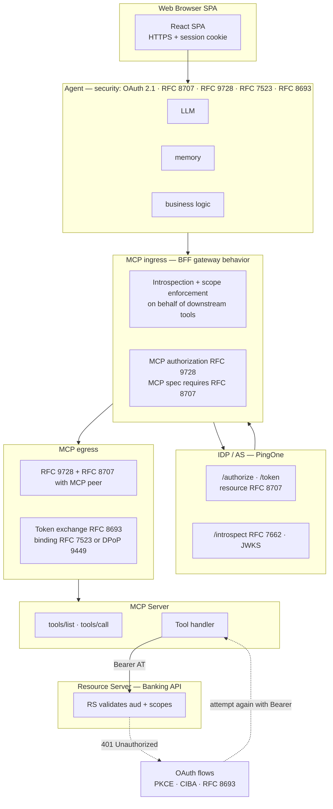
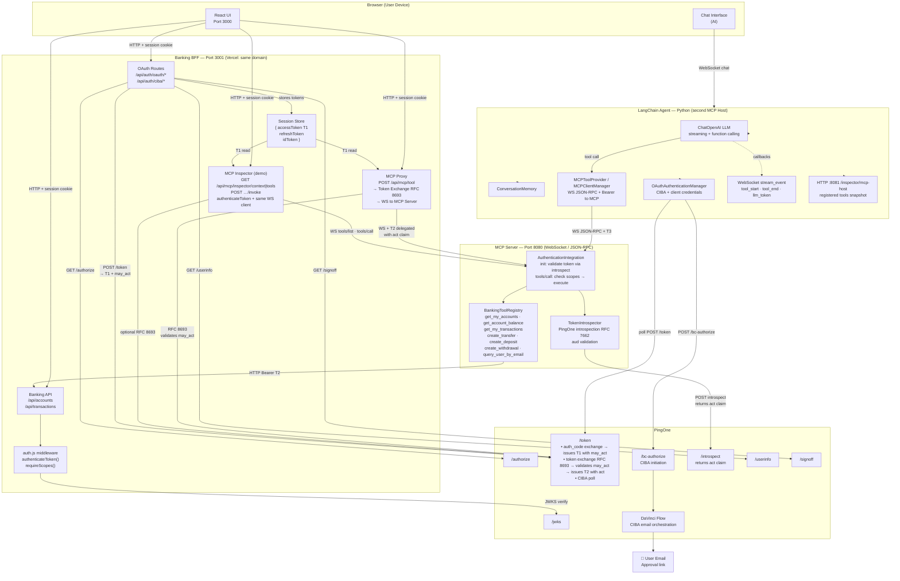
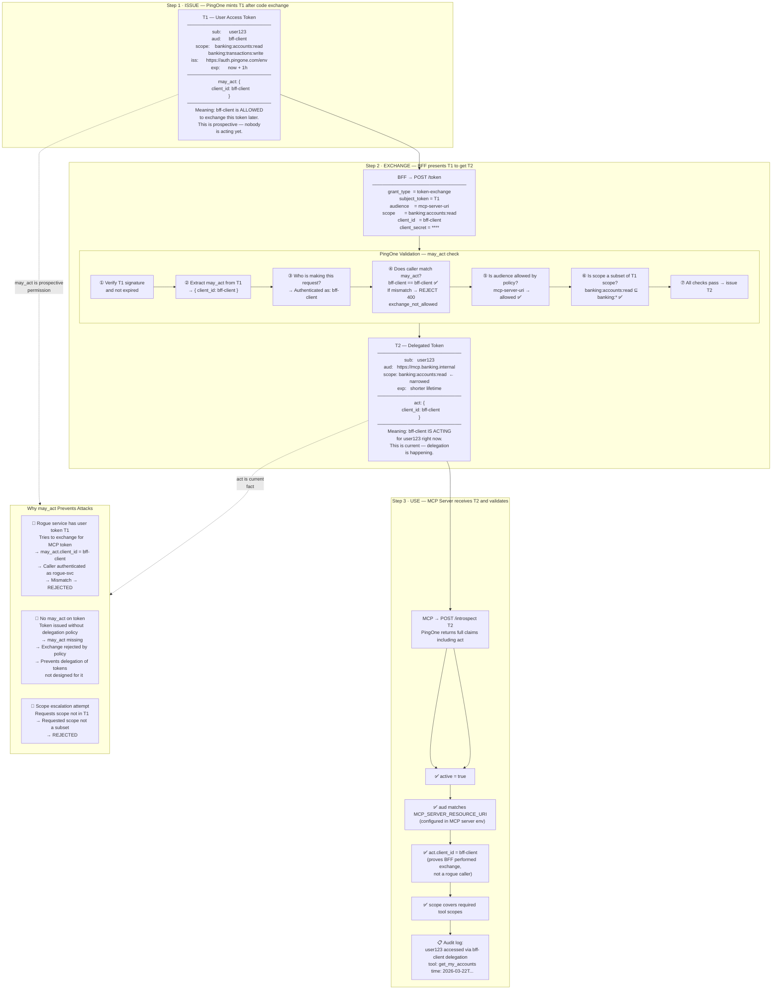
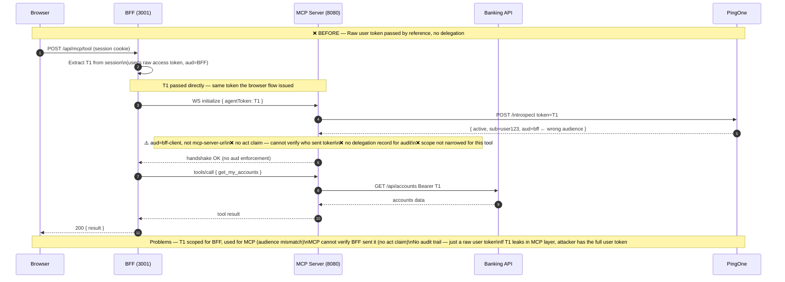
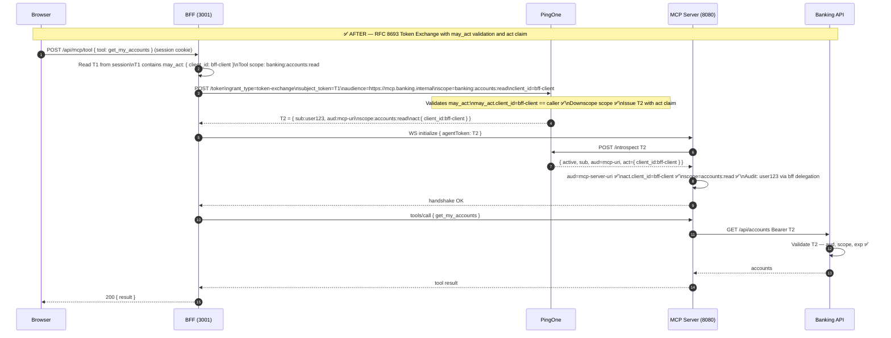
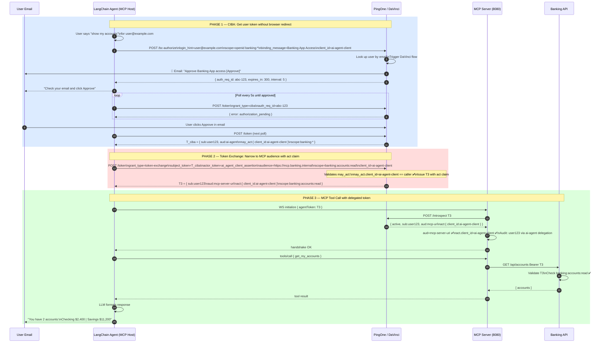
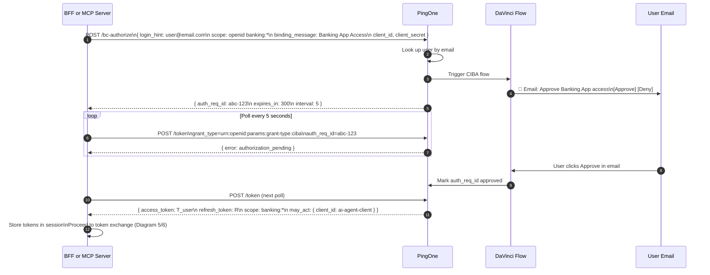
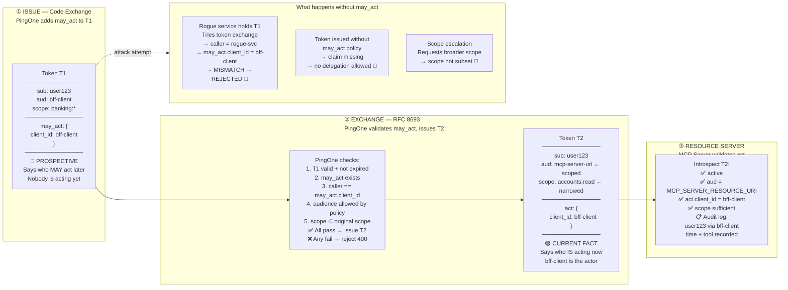
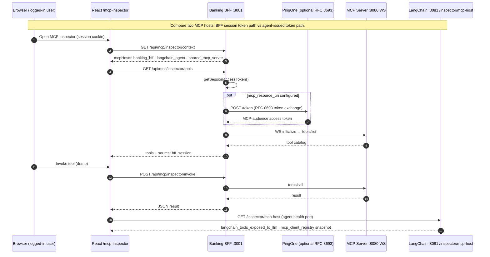

# Banking App — Architecture diagrams (Mermaid)

Source of truth for the diagrams below. Open in **diagrams.net (draw.io)** with your Mermaid extension and paste **one** fenced block at a time.

**Reference Visio:** `Agent Gateway demo architecture.vsdx` (repo root) — swimlanes, security/RFC strips, MCP ingress & egress gateway behavior, Baseline vs Gateway, 401 → OAuth → Bearer retry, and phased OAuth with **resource** (RFC 8707). The diagram below mirrors that **pattern** and labels; ports and hosts match this banking repo.

---

## Diagram 0: Agent Gateway pattern (aligned with Agent Gateway demo architecture.vsdx)

Same information class as the Visio: actors, RFC callouts, ingress/egress, RS as audience-bound resource.

### Phased OAuth with resource indicator (RFC 8707) — same steps as reference slide

| Phase | Step | Action |
|-------|------|--------|
| 1 | 1–4 | Authorization request with `resource=<RS URL>` → consent → authorization **code** |
| 2 | 5–6 | Token request `grant_type=authorization_code` + `resource` → AS limits **audience** to RS |
| 3 | 7–8 | Resource request `Authorization: Bearer` → RS validates audience |

---

## Diagram 1: Component Architecture

---

## Diagram 2: Complete Step-by-Step Flow — Login → Token Exchange → Banking Agent Gets Results

```mermaid
sequenceDiagram
    autonumber
    participant U as User / Browser
    participant BFF as Banking BFF
    participant P1 as PingOne
    participant MCP as MCP Server
    participant API as Banking API

    rect rgb(220, 235, 255)
        Note over U,P1: PHASE 1 — Authorization Code Flow (User Login)
        U->>BFF: Click Login
        BFF->>BFF: Generate state (CSRF protection)\nGenerate PKCE code_verifier (random 64 bytes)\nCompute code_challenge = base64url(sha256(verifier))\nDerive redirect_uri from request host
        BFF-->>U: 302 → PingOne /authorize\n?response_type=code\n&client_id=bff-client\n&redirect_uri=https://domain/callback\n&scope=openid profile email banking:*\n&code_challenge=ABC123\n&code_challenge_method=S256\n&state=CSRF_TOKEN
        U->>P1: GET /authorize (browser follows redirect)
        P1-->>U: Login page
        U->>P1: Enter credentials + submit
        P1->>P1: Authenticate user\nApply sign-on policy\nGenerate authorization_code
        P1-->>U: 302 → /callback?code=AUTH_CODE&state=CSRF_TOKEN
    end

    rect rgb(220, 255, 220)
        Note over U,P1: PHASE 2 — Code Exchange + PingOne Issues Token WITH may_act
        U->>BFF: GET /callback?code=AUTH_CODE&state=CSRF_TOKEN
        BFF->>BFF: Validate state = CSRF_TOKEN ✅\nRetrieve code_verifier from session
        BFF->>P1: POST /token\ngrant_type=authorization_code\ncode=AUTH_CODE\ncode_verifier=PKCE_VERIFIER\nclient_id=bff-client\nclient_secret=...
        P1->>P1: Verify code_verifier matches challenge ✅\nIssue T1 with may_act claim\n(PingOne policy: bff-client may act for users)
        P1-->>BFF: T1 = JWT { sub: user123\n  aud: bff-client\n  scope: banking:*\n  may_act: { client_id: bff-client }\n  exp, iat, iss }
        Note over BFF: may_act says:\n"bff-client is ALLOWED to\nexchange this token later"
        BFF->>BFF: session.regenerate() ← prevent session fixation\nStore T1 in session (server-side only)\nNever send T1 to browser
        BFF-->>U: 302 → /dashboard\nSet-Cookie: session=XYZ (httpOnly, secure)
    end

    rect rgb(255, 245, 220)
        Note over U,API: PHASE 3 — User Asks AI Agent for Account Data
        U->>BFF: POST /api/mcp/tool\n{ tool: get_my_accounts }\nCookie: session=XYZ
        BFF->>BFF: Read T1 from session\nLook up tool scopes:\nget_my_accounts → banking:accounts:read
    end

    rect rgb(255, 220, 220)
        Note over BFF,P1: PHASE 4 — RFC 8693 Token Exchange (BFF presents may_act, gets act)
        BFF->>P1: POST /token\ngrant_type=urn:ietf:params:oauth:grant-type:token-exchange\nsubject_token=T1\nsubject_token_type=access_token\naudience=https://mcp.banking.internal\nscope=banking:accounts:read\nclient_id=bff-client\nclient_secret=...

        Note over P1: PingOne validates may_act (WHY this matters ↓):\n1. Verify T1 signature + not expired\n2. Extract may_act: { client_id: bff-client }\n3. Check authenticated caller = bff-client\n4. caller matches may_act.client_id ✅\n5. Requested audience allowed by policy ✅\n6. Requested scope ⊆ original scope ✅\n→ Without may_act, exchange is REJECTED\n→ Prevents any rogue service from\n   exchanging user tokens it shouldn't have

        P1-->>BFF: T2 = JWT { sub: user123\n  aud: https://mcp.banking.internal\n  scope: banking:accounts:read\n  act: { client_id: bff-client }\n  exp: shorter lifetime }
        Note over BFF: act says:\n"bff-client IS ACTING\nright now for user123"\nT1 never leaves the BFF
    end

    rect rgb(220, 255, 245)
        Note over BFF,API: PHASE 5 — MCP Server Validates Delegation + Executes Tool
        BFF->>MCP: WS initialize\n{ agentToken: T2 }
        MCP->>P1: POST /introspect token=T2
        P1-->>MCP: { active: true\n  sub: user123\n  aud: https://mcp.banking.internal\n  act: { client_id: bff-client }\n  scope: banking:accounts:read }
        MCP->>MCP: aud = mcp resource URI ✅\nact.client_id = known BFF client ✅\nscope sufficient for get_my_accounts ✅\nLog: "user123 delegated via bff-client"
        MCP-->>BFF: handshake OK

        BFF->>MCP: tools/call { get_my_accounts }
        MCP->>API: GET /api/accounts\nAuthorization: Bearer T2
        API->>API: Validate T2 (JWKS)\nCheck banking:accounts:read scope ✅\nFilter accounts for sub=user123
        API-->>MCP: [ { id, type, balance }, ... ]
        MCP-->>BFF: tool result
        BFF-->>U: 200 { result: [ accounts ] }
    end
```

---

## Diagram 3: may_act Claim — What It Is, How It's Checked, Why It Matters

---

## Diagram 4: Token Exchange — BEFORE (Current State — No Delegation)

---

## Diagram 5: Token Exchange — AFTER (RFC 8693 with may_act → act)

---

## Diagram 6: AI Agent (LangChain) Full Flow — CIBA → Token Exchange → Tool Result

---

## Diagram 7: CIBA Email Approval Flow

---

## Diagram 8: may_act Claim Lifecycle — Prospective vs Current

---

## Diagram 9: MCP Inspector — dual hosts (BFF vs LangChain)

