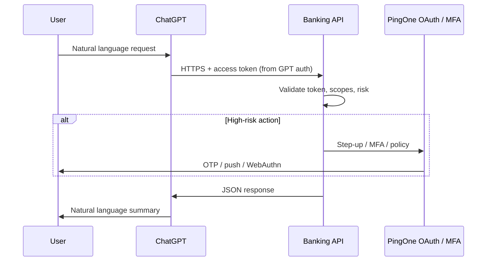

# ChatGPT integration plan — Super Banking banking demo

This document describes how to let end users interact with the banking backend from **their own ChatGPT experience** (Custom GPT Actions, ChatGPT “apps” / connectors, or similar), instead of—or in addition to—the in-app banking agent.

---

## 1. Objectives

- Users can complete banking-oriented tasks via natural language **inside ChatGPT**, backed by **this project’s APIs** and **the user’s own authorization**.
- Prefer **OAuth to PingOne** (existing identity) over storing raw bank credentials inside ChatGPT.
- **OTP / step-up** for sensitive operations should be enforced **by the banking API and PingOne**, not as a permanent secret typed into ChatGPT.

---

## 2. Integration patterns (ChatGPT side)

| Pattern | What we ship | Typical auth in ChatGPT |
|--------|----------------|-------------------------|
| **Custom GPT + Actions** | OpenAPI 3 schema over HTTPS | **OAuth 2.0** (authorization code); ChatGPT stores/refreshes user tokens |
| **ChatGPT apps / connectors** | Registered integration + HTTPS API | Often OAuth; “username/password” fields may exist for **connector or legacy IdP**—still prefer OAuth to PingOne |

**Recommendation:** Design for **OAuth 2.0 + PKCE** (or PingOne’s supported flows) as the primary path. Treat username/password fields in ChatGPT as **demo-only** or transitional, with tight limits and clear non-production labeling.

---

## 3. Target architecture



---

## 4. Banking API surface (proposed)

Introduce a **dedicated, auditable** route prefix (examples):

| Method | Path (example) | Purpose |
|--------|----------------|---------|
| GET | `/api/integrations/chatgpt/me` | Safe profile / session summary |
| GET | `/api/integrations/chatgpt/accounts` | User’s accounts (scoped) |
| GET | `/api/integrations/chatgpt/transactions` | Recent transactions (paginated) |
| POST | `/api/integrations/chatgpt/transfers` | Optional; only if product allows; **idempotency-key** required |

**Design rules:**

- Reuse existing **middleware**: `authenticateToken`, `requireScopes`, demo mode, step-up gates where applicable.
- Return **stable JSON errors** for the GPT, e.g. `requires_mfa`, `insufficient_scope`, `step_up_required`, `idempotency_replay`.
- **Rate limit** and **audit log** all calls with `integration=chatgpt` (or similar) and subject identifier.

**OpenAPI:** Publish a single OpenAPI 3 document that ChatGPT Actions can import; it should reference **only** these integration paths and the production base URL.

---

## 5. Authentication

### 5.1 Preferred: OAuth to PingOne

1. Create (or reuse) a **PingOne application** used solely or primarily for “ChatGPT / external agent” clients.
2. Configure **redirect URIs** allowed by OpenAI / ChatGPT for the OAuth client used by Custom GPTs (per current OpenAI documentation).
3. Scopes: **minimal** set (e.g. read-only vs transfers); separate client for read-only vs write if needed.
4. ChatGPT **Actions → Authentication → OAuth 2.0**: authorization URL, token URL, client id (secret handling per OpenAI’s model).

### 5.2 Step-up / OTP

- Do **not** rely on ChatGPT collecting OTP as a long-lived field.
- When a route requires MFA, respond with something like:

  ```json
  {
    "error": "step_up_required",
    "message": "Complete verification to continue.",
    "authorization_url": "https://..."
  }
  ```

- User completes step-up in the **browser** (PingOne); subsequent ChatGPT calls succeed with refreshed session/token as defined by your implementation.

### 5.3 Fallback (demo only): username / password

- If a connector only supports HTTP basic or static fields: expose a **demo-only** token endpoint, short TTL, heavy rate limits, disabled in production via env flag.
- Document clearly: **not for real credentials**.

---

## 6. Custom GPT packaging

1. **Instructions (system prompt):** Only use defined Actions; never invent account numbers; handle `step_up_required` and scope errors politely.
2. **Actions:** Import OpenAPI schema; set OAuth as above.
3. **Privacy:** Disclose that balances/transactions may appear in chat; link to project privacy / demo disclaimer.
4. **Testing:** Staging API base URL + test users in PingOne before production GPT.

---

## 7. Security and compliance checklist

- [ ] Dedicated OAuth client (or constrained scopes) for ChatGPT integration  
- [ ] Separate rate limits for `/api/integrations/chatgpt/*`  
- [ ] Structured audit logs (user id, action, outcome, correlation id)  
- [ ] Global kill switch: `CHATGPT_INTEGRATION_ENABLED=false` (or similar)  
- [ ] Document data retention implications of ChatGPT conversation history (OpenAI / enterprise policies)  
- [ ] Optional hardening: IP restrictions only if compatible with OpenAI’s egress (often impractical—prefer OAuth + scopes + risk checks)

---

## 8. Optional: MCP alongside Actions

This repo already has MCP-related surfaces. The same **authorization and business rules** can back:

- **OpenAPI Actions** (ChatGPT Custom GPT), and/or  
- **MCP tools** (clients that speak MCP)

Keep **one** source of truth for “what a user may do”; avoid duplicating policy in two places.

---

## 9. Phased rollout

| Phase | Deliverable |
|-------|-------------|
| **A** | OpenAPI spec + stub routes or Backend-for-Frontend (BFF) proxy to existing handlers |
| **B** | OAuth client in PingOne + GPT OAuth config on staging |
| **C** | Read-only actions (accounts, transactions) in production GPT |
| **D** | Transfers (if allowed) + step-up behavior validated end-to-end |
| **E** | Monitoring, runbooks, kill switch tested |

---

## 10. Open decisions

- **Read-only vs write:** Should ChatGPT ever initiate transfers, or only read balances/history?  
- **OAuth client strategy:** New “ChatGPT” app vs reuse end-user app with extra redirect URIs?  
- **Distribution:** Workspace-only GPT vs public listing (affects review and liability).

---

## 11. References in this repo

- OAuth / PingOne patterns: `.claude/skills/oauth-pingone/SKILL.md`  
- API and scope patterns: `banking_api_server` routes and `middleware/auth.js`  
- Vercel/session notes: `.claude/skills/vercel-banking/SKILL.md`  

---

*Last updated: 2026-03-25*
